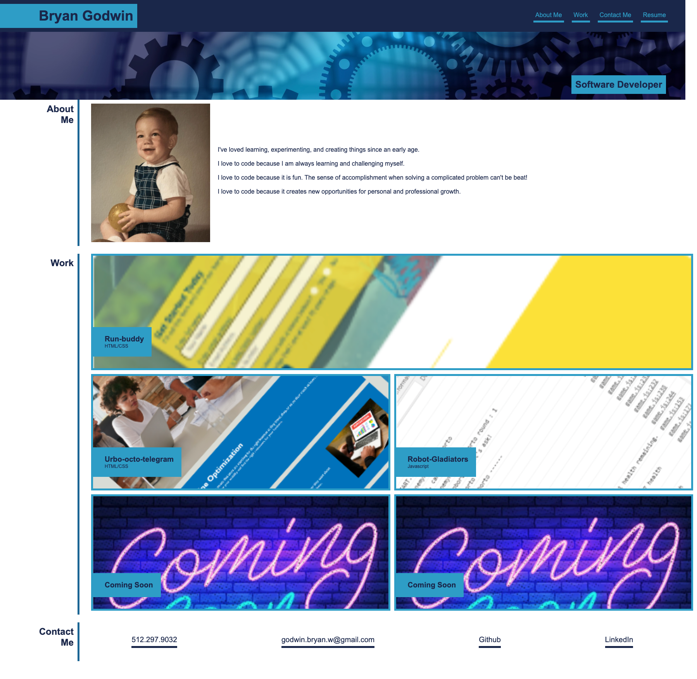

# **Bryan Godwin - Week 2 Challenge**

## **Advanced CSS Challenge: Professional Portfolio**

### This challenge is to build a website to showcase your work portfolio

### **User Story**

    AS AN employer
    I WANT to view a potential employee's deployed portfolio of work samples
    SO THAT I can review samples of their work and assess whether they're a good candidate for an open position

### **Acceptance Critera**

1.  Provides relevant deveopler info

        WHEN I load their portfolio
        THEN I am presented with the developer's name, a recent photo, and links to sections about them, their work, and how to contact them

2.  Working navigation links

        WHEN I click one of the links in the navigation
        THEN the UI scrolls to the corresponding section

3.  Provides titled images of developer's applications

        WHEN I click on the link to the section about their work
        THEN the UI scrolls to a section with titled images of the developer's applications

4.  Showcases the developer's first application

        WHEN I am presented with the developer's first application
        THEN that application's image should be larger in size than the others

5.  Provides links to all the developer's deployed applications

        WHEN I click on the images of the applications
        THEN I am taken to that deployed application

6.  Website is responsive designed

        WHEN I resize the page or view the site on various screens and devices
        THEN I am presented with a responsive layout that adapts to my viewport

### **Challenge Two - code repository**

<https://godwinbw.github.io/my_showcase/>

### **Challenge Two - live link**

<https://godwinbw.github.io/my_showcase/develop/>

### **Challenge Two - screenshot**

